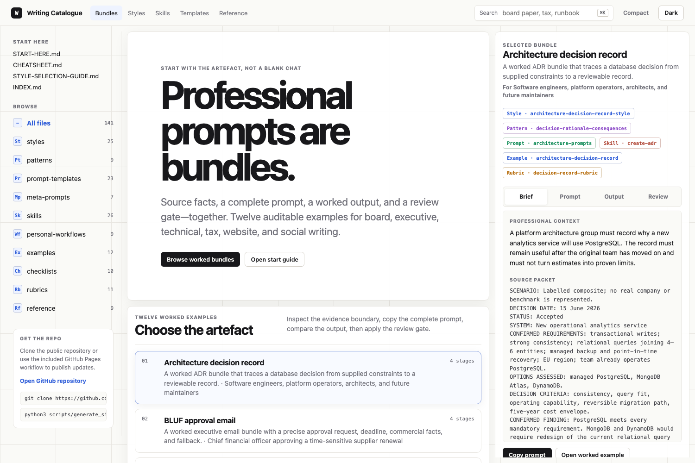
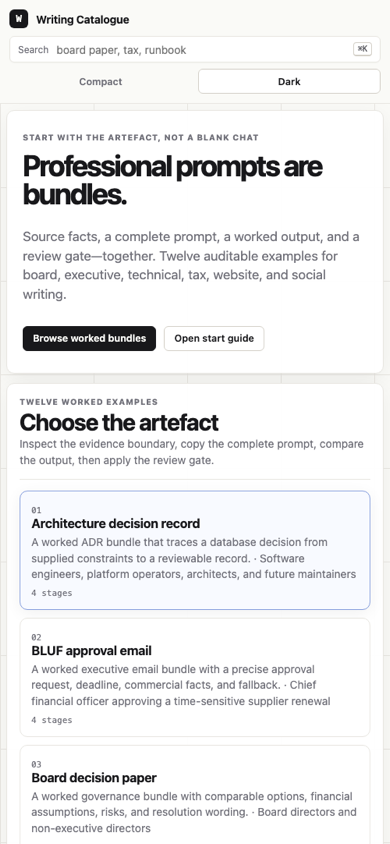

# Writing Style Catalogue

A practical, reusable catalogue of writing styles, prompt templates, document-generation skills, and end-to-end workflows for use with large language models.

---

## GitHub Pages site

This repository includes a static GitHub Pages catalogue at [index.html](index.html). It turns the Markdown files into a searchable workflow-first interface using generated data from [scripts/generate_site_data.py](scripts/generate_site_data.py).





Preview locally:

```bash
python3 scripts/generate_site_data.py
python3 -m http.server 8765
```

Then open `http://127.0.0.1:8765/`.

To publish, enable **GitHub Pages > Build and deployment > GitHub Actions** in the repository settings. The included workflow at [.github/workflows/pages.yml](.github/workflows/pages.yml) regenerates the catalogue data, regenerates the Markdown index, validates internal links, and deploys the static site.

---

## Who this is for

This catalogue is designed for professionals who write documents and use AI to help:

- **IT and technology leaders** — cloud migration briefings, incident reports, architecture decisions, runbooks, IAM strategy papers
- **Tax and finance professionals** — technical notes, board papers, regulatory submissions, client memos
- **Consultants and strategists** — proposals, strategy memos, executive briefings, business cases
- **Executives and board members** — investor updates, performance reviews, approval memos, stakeholder communications
- **Marketing, product, and website owners** — SEO audits, conversion reviews, content plans, and 90-day website improvement roadmaps
- **Job seekers** — cover letters, LinkedIn profiles, application materials
- **Learners and educators** — study summaries, tutorials, Socratic explainers, learning notes

---

## Start here

| I want to… | Go to… |
|------------|--------|
| Know what to copy first | [START-HERE.md](START-HERE.md) |
| Get started in 5 minutes | [QUICKSTART.md](QUICKSTART.md) |
| Find style + skill + template for my situation | [CHEATSHEET.md](CHEATSHEET.md) |
| Choose a style systematically | [STYLE-SELECTION-GUIDE.md](STYLE-SELECTION-GUIDE.md) |
| Understand the repository layout | [REPO-MAP.md](REPO-MAP.md) |
| Browse everything | [INDEX.md](INDEX.md) |
| Read a worked example | [examples/](examples/) |

---

## How this catalogue works

Every well-written professional document combines three things:

| Component | What it is | Where to find it |
|-----------|-----------|------------------|
| **Style** | The framework that shapes writing — structure, tone, length, emphasis | `styles/` |
| **Pattern** | A reusable structure for one section or argument | `patterns/` |
| **Skill** | The process for creating a specific document type (PDF, slide deck, runbook, board pack) | `skills/` |
| **Prompt template** | The copy-paste prompt you give an LLM to generate the document | `prompt-templates/` |
| **Rubric** | The quality standard used to judge whether the result is usable | `rubrics/` |

### The combination pattern

```
Style + Pattern + Prompt Template + Skill + Rubric → Document
```

Pick your style first. Use a pattern when a section needs a clear structure. Then choose the skill that matches your output format, copy the prompt template, fill in the placeholders, and review the output against the relevant rubric.

---

## Common combinations

| Goal | Style | Skill | Template |
|------|-------|-------|----------|
| Approval email to CFO | BLUF | — | [email-prompts.md](prompt-templates/email-prompts.md) |
| Board paper on major decision | Board Paper | [create-board-pack.md](skills/create-board-pack.md) | [board-paper-prompts.md](prompt-templates/board-paper-prompts.md) |
| Cloud migration briefing | Executive Briefing | [create-one-page-brief.md](skills/create-one-page-brief.md) | [executive-summary-prompts.md](prompt-templates/executive-summary-prompts.md) |
| Tax technical note | Tax Advisory | [create-tax-technical-note.md](skills/create-tax-technical-note.md) | [tax-note-prompts.md](prompt-templates/tax-note-prompts.md) |
| Incident post-mortem | Incident Report | — | [incident-report-prompts.md](prompt-templates/incident-report-prompts.md) |
| Operational runbook | Technical Documentation | [create-runbook.md](skills/create-runbook.md) | [technical-documentation-prompts.md](prompt-templates/technical-documentation-prompts.md) |
| Architecture decision record | ADR | [create-adr.md](skills/create-adr.md) | [decision-record-prompts.md](prompt-templates/decision-record-prompts.md) |
| Job cover letter | Job Application | — | [job-application-prompts.md](prompt-templates/job-application-prompts.md) |
| Slide deck | Consulting Style | [create-slide-deck.md](skills/create-slide-deck.md) | [presentation-prompts.md](prompt-templates/presentation-prompts.md) |
| PDF-ready report | Executive Briefing | [create-pdf.md](skills/create-pdf.md) | [pdf-document-prompts.md](prompt-templates/pdf-document-prompts.md) |
| Website marketing and SEO audit | Executive Briefing | [create-website-marketing-seo-audit.md](skills/create-website-marketing-seo-audit.md) | [website-marketing-seo-prompts.md](prompt-templates/website-marketing-seo-prompts.md) |
| Risk register | Consulting Style | [create-risk-register.md](skills/create-risk-register.md) | — |
| Sales outreach email | Persuasive Sales | [create-email-sequence.md](skills/create-email-sequence.md) | [sales-outreach-prompts.md](prompt-templates/sales-outreach-prompts.md) |
| Study or learning summary | Plain English | — | [learning-notes-prompts.md](prompt-templates/learning-notes-prompts.md) |
| Supplier or importer outreach | Persuasive Sales | — | [sales-outreach-prompts.md](prompt-templates/sales-outreach-prompts.md) |

---

## Common workflows

### Quick (10 minutes): update or email

1. Open [START-HERE.md](START-HERE.md) or [CHEATSHEET.md](CHEATSHEET.md) — find your situation row
2. Copy the prompt from the template in column 4
3. Fill in the `[PLACEHOLDERS]`
4. Paste into your LLM
5. Review against the checklist in the style file

### Standard (30 minutes): memo, briefing, or report

1. Open [STYLE-SELECTION-GUIDE.md](STYLE-SELECTION-GUIDE.md) — work through the decision tree
2. Open the chosen style file in `styles/` — read the structure and copy-paste prompt
3. Open the matching skill file in `skills/` — follow the inputs and output structure
4. Copy the prompt template — customise the placeholders
5. Generate in your LLM (Claude, ChatGPT, Gemini, or similar)
6. Review against the quality checklist in `checklists/`

### End-to-end (1–4 hours): complex document

Use a pre-built workflow from `personal-workflows/`:

- [Executive Update Workflow](personal-workflows/executive-update-workflow.md) — quarterly or board updates
- [Board Paper Workflow](personal-workflows/board-paper-workflow.md) — full governance paper
- [Tax Technical Note Workflow](personal-workflows/tax-technical-note-workflow.md) — adviser memo or client note
- [Cloud Migration Briefing](personal-workflows/cloud-migration-briefing-workflow.md) — senior stakeholder briefing
- [IAM Strategy Workflow](personal-workflows/iam-strategy-workflow.md) — identity and access management paper
- [Website Marketing and SEO Audit Workflow](personal-workflows/website-marketing-seo-audit-workflow.md) — URL-led current-state report and action plan
- [Job Application Workflow](personal-workflows/job-application-workflow.md) — cover letter and profile
- [Supplier Outreach Workflow](personal-workflows/supplier-importer-outreach-workflow.md) — commercial outreach
- [Study Summary Workflow](personal-workflows/one-page-study-summary-workflow.md) — learning synthesis

---

## Repository structure

```
writing-style-catalogue/
├── index.html           GitHub Pages catalogue interface
├── assets/              site CSS, JavaScript, catalogue data, and screenshots
├── styles/              25 writing frameworks with copy-paste prompts
├── patterns/             reusable argument and section structures
├── prompt-templates/    23 copy-paste LLM prompts by document type
├── meta-prompts/         prompts for improving prompts and drafts
├── skills/              26 document-generation processes
├── personal-workflows/   9 end-to-end worked workflows
├── examples/            11 realistic output samples
├── checklists/           quick quality review checklists
├── rubrics/              scoring guides for professional review
├── reference/            reference guides (tone, structure, prompting)
├── scripts/              Python utility scripts
└── .github/workflows/    GitHub Pages deployment workflow
```

---

## Key reference files

| File | Use it when… |
|------|-------------|
| [CHEATSHEET.md](CHEATSHEET.md) | You need to pick style + skill + template quickly |
| [START-HERE.md](START-HERE.md) | You need the shortest route from task to artefact |
| [REPO-MAP.md](REPO-MAP.md) | You need to understand where things live |
| [STYLE-SELECTION-GUIDE.md](STYLE-SELECTION-GUIDE.md) | You're unsure which style to use |
| [patterns/README.md](patterns/README.md) | You need a reliable section structure |
| [meta-prompts/README.md](meta-prompts/README.md) | Your prompt or generated output needs improvement |
| [rubrics/README.md](rubrics/README.md) | You need to judge if output is good enough |
| [reference/tone-spectrum.md](reference/tone-spectrum.md) | You need to set the right tone deliberately |
| [reference/good-vs-bad-prompts.md](reference/good-vs-bad-prompts.md) | Your LLM output isn't what you expected |
| [reference/llm-prompting-principles.md](reference/llm-prompting-principles.md) | You want to improve your prompting technique |
| [reference/website-seo-audit-inputs-and-evidence.md](reference/website-seo-audit-inputs-and-evidence.md) | You need to know what a URL audit can and cannot prove |
| [checklists/ai-output-review-checklist.md](checklists/ai-output-review-checklist.md) | Before you send or publish anything |

---

## How to add new content

1. **New style** — Copy any file from `styles/`, rename it, complete all 10 sections and the YAML frontmatter
2. **New prompt template** — Copy from `prompt-templates/`, complete all 6 sections including example input and output
3. **New skill** — Copy from `skills/`, complete all 8 sections
4. **New pattern, meta-prompt, or rubric** — Keep it short, operational, and copy-paste ready
5. **Regenerate the Pages data** — Run `python3 scripts/generate_site_data.py` from the repo root
6. **Update the index** — Run `python3 scripts/generate_index.py` from the repo root
7. **Validate links** — Run `python3 scripts/validate_links.py` from the repo root

See [CONTRIBUTING.md](CONTRIBUTING.md) for full guidelines.

---

British English throughout. MIT licence. Use freely, modify, share.
