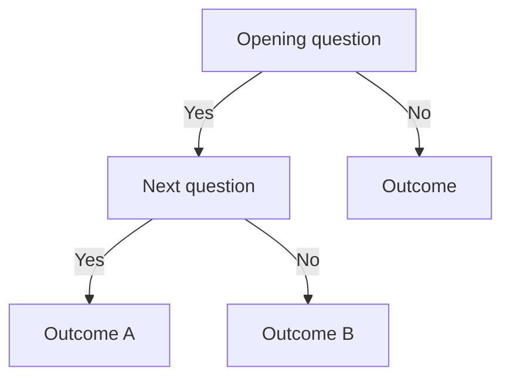

# Skill: Create Decision Tree

## What this skill does

Maps a decision process as a branching tree of yes/no questions or criteria, showing the path from an initial situation to a specific outcome or action. Decision trees are useful when a process has multiple conditions that must be evaluated in a specific order, and where different combinations of conditions lead to different conclusions. The LLM can produce a text-based tree or Mermaid diagram syntax that a tool like GitHub, Notion, or Confluence can render visually. Decision trees are faster to navigate than prose guidance and less error-prone than lists of rules.

## When to use it

- Mapping an IAM access request approval process where different user types, data sensitivity levels, and approval tiers determine the outcome
- Creating a tax categorisation decision tree (e.g. "Is this supply VAT exempt or standard-rated?") for use by non-specialist staff
- Building a cloud incident severity triage tree that determines P1/P2/P3 classification based on service impact and user count
- Designing a customer query routing tree for a support team that handles multiple product lines
- Documenting an investment decision framework where different risk and return combinations lead to different portfolio actions

## Inputs required

- The starting question or situation — the entry point to the tree
- The key decision criteria — the yes/no or multi-choice questions asked at each node
- The order in which criteria should be evaluated (not all criteria are equally discriminating)
- The endpoints — the specific outcomes, actions, or recommendations at the end of each branch
- Any conditions that immediately force an outcome (short-circuit paths)
- The intended user (will they know the terminology, or does each node need a definition?)

## Copy-paste prompt

```
You are a process designer and decision analyst. Create a decision tree for the process described below.

AUDIENCE: [Who will navigate this tree — e.g. on-call engineer, non-specialist tax analyst, support agent, new joiner]
PURPOSE: [What decision or classification the tree supports]
CONTEXT: [Domain knowledge the tree user is expected to have; any terminology to define]
INPUT: [The decision criteria, conditions, and outcomes — in any order; include any short-circuit conditions]
DESIRED_OUTCOME: [The set of clear, actionable endpoints the tree must produce]
TONE: Terse and instructional. Each node is a question; each branch is an answer; each leaf is an action or outcome.
LENGTH: As deep as the process requires. Aim for no more than 6 levels of depth; beyond that, split into sub-trees.
FORMAT: Text-based indented tree first, then Mermaid diagram syntax if visual rendering is needed. Use YES/NO for binary branches; use labelled options for multi-choice branches.
CONSTRAINTS: Use British English. Every node must be answerable by the user with information they actually have. Every endpoint must be a clear action or outcome — not "seek further advice" unless that is genuinely the correct instruction. Output only the decision tree; no preamble.

FORMAT EXAMPLE (text-based):
START: [Opening question]
├── YES → [Next question or outcome]
│   ├── YES → [Outcome A]
│   └── NO → [Outcome B]
└── NO → [Next question or outcome]
    ├── [Option 1] → [Outcome C]
    └── [Option 2] → [Outcome D]

FORMAT EXAMPLE (Mermaid):

```

## Suggested output structure

- **Title and purpose** — one sentence describing what the tree classifies or decides
- **Entry point** — the first question at the root of the tree
- **Branches** — yes/no or multi-choice paths; each branch leads either to another question or an outcome
- **Outcomes / leaf nodes** — specific, actionable results: an approved action, a rejection, an escalation, a classification code
- **Legend or definitions** — if any nodes use technical terms the user may not know
- **Mermaid diagram** (optional) — for visual rendering in GitHub, Confluence, or Notion

## Quality controls

- [ ] Every node is a question with a clear answer (not a statement or a topic label)
- [ ] Every branch is labelled — the user knows which path to take
- [ ] Every leaf node is a specific action or outcome — not "consult manager" unless that is the correct and only instruction
- [ ] The tree does not require information the user does not have at the time of navigation
- [ ] No branch requires more than 6 levels of depth (split into sub-trees if deeper)
- [ ] The most common paths are the shortest (most frequent cases should reach an outcome quickly)
- [ ] The tree has been walked through with at least 3 realistic scenarios to verify correctness

## Common failure modes

- **Nodes are statements not questions**: "Data sensitivity" is not a node — "Is this data classified as Restricted or above?" is a navigable node
- **Too many options per branch**: A node with 5 options is usually better expressed as two binary questions in sequence
- **Impossible answers**: If a node asks "How many users are affected?" but the responder cannot know this at triage time, the tree breaks — only include criteria that are knowable at the point of use
- **Outcomes too vague**: "Escalate if unsure" is not an outcome — specify who to escalate to, via which channel, and with what information
- **Tree too deep**: Beyond 6 levels, users lose track of their path — use a reference number system or split into sub-trees with named entry points

## Example request

"Create a decision tree for classifying the severity of a cloud infrastructure incident. Entry criteria: Is a production service affected? If yes: are more than 100 users unable to work? If yes: P1 (page on-call engineer immediately). If fewer than 100: P2 (alert on-call engineer via Teams, response within 30 minutes). If no production service affected: Is a development environment affected? If yes: P3 (raise ticket, respond within next business day). If no: close as false alarm. Include a short-circuit: any security incident (suspected breach, data exfiltration) is always P1 regardless of user count."
