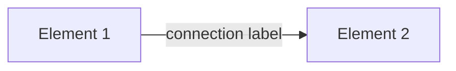

# Skill: Create Visual Diagram Spec

## What this skill does

Produces a written specification for a visual diagram — an architecture diagram, process flow, organisational chart, customer journey map, or data flow diagram — in enough detail that a designer or a diagram tool can create it without further input. The LLM can also produce Mermaid diagram syntax for diagrams that can be rendered directly in GitHub, Confluence, or Notion. This skill bridges the gap between knowing what you want to show and being able to communicate it precisely to someone who will build the visual. A good visual spec is 10–20 lines; a great Mermaid diagram is fully self-contained.

## When to use it

- Specifying an architecture diagram for the technical section of a board paper or business case (e.g. Azure cloud architecture before and after migration)
- Designing a process flow for an SOP or runbook where a visual improves comprehension over text
- Creating a swim-lane diagram that shows how an IAM provisioning process moves between teams
- Producing a data flow diagram for a GDPR data protection impact assessment
- Specifying an organisational chart or RACI matrix as a visual for a programme governance document

## Inputs required

- The type of diagram (flowchart, architecture diagram, swim-lane, org chart, data flow, entity-relationship, customer journey)
- The purpose: what must the diagram communicate and to whom?
- The elements to include: nodes, components, actors, systems, or entities
- The relationships between elements: connections, data flows, dependencies, sequences, or hierarchies
- Any visual style requirements: brand colours, icon sets, diagramming conventions (C4 model, ArchiMate, BPMN)
- The output format: Mermaid code (for rendering), a written spec (for a designer), or both
- The level of detail required: high-level conceptual vs. technical implementation detail

## Copy-paste prompt

```
You are a visual design and information architecture specialist. Create a diagram specification for the visual described below.

AUDIENCE: [Who will view the final diagram — e.g. board, C-suite, technical team, client; and who will build it — designer, developer, or diagram tool]
PURPOSE: [What the diagram must communicate — what understanding should the viewer have after seeing it?]
CONTEXT: [Domain context — e.g. cloud architecture, IAM process, organisational structure, data flow; any existing conventions or standards]
INPUT: [Describe all elements to include — systems, actors, processes, data flows, relationships, or hierarchy; note what is in scope and out of scope]
DESIRED_OUTCOME: [A viewer can understand [specific thing] from this diagram without needing a verbal explanation]
TONE: Technical and precise for architecture diagrams; clear and accessible for process and journey diagrams.
LENGTH: Written spec: 10–20 lines describing each element and relationship. Mermaid code: complete and executable.
FORMAT: First produce a written specification (elements, relationships, layout guidance, visual style). Then produce Mermaid diagram code if the diagram type is supported (flowchart, sequence, class, state, ER, gantt). Note which Mermaid diagram type applies.
CONSTRAINTS: Use British English in labels and annotations. Do not include elements that are out of scope — a diagram that tries to show everything shows nothing. Every node must have a clear label. Every connection must have a direction. Output only the spec and Mermaid code; no preamble.

WRITTEN SPEC FORMAT:
**Diagram type**: [e.g. Flowchart / Architecture / Swim-lane / Sequence / ER]
**Title**: [Short, descriptive title]
**Purpose**: [One sentence]
**Audience**: [Role and knowledge level]

**Elements**:
- [Element 1]: [Label] — [Description and type: system / actor / process / data store]
- [Element 2]: [Label] — [Description]

**Relationships**:
- [Element 1] → [Element 2]: [Label on connection, e.g. "sends authentication request"]

**Layout guidance**: [Left-to-right / Top-to-bottom / Swim-lanes with named lanes]
**Visual style**: [Colour coding, icon set, line style for different relationship types]

MERMAID CODE:

```

## Suggested output structure

- **Written specification** — diagram type, title, purpose, audience; elements list; relationships list; layout guidance; visual style
- **Mermaid diagram code** — executable code for supported diagram types; include a key/legend if the diagram uses colour coding or multiple relationship types
- **Designer notes** — for complex diagrams: notes on relative sizing, grouping, background zones, or callout annotations that the Mermaid code cannot capture

## Quality controls

- [ ] Every element in the written spec appears in the Mermaid code and vice versa
- [ ] Every connection has a direction (→ or ↔) and a label
- [ ] The diagram title is descriptive and specific — not "Architecture Diagram" but "Azure IaaS target architecture — post-migration"
- [ ] The Mermaid code executes without error in a standard renderer (test in mermaid.live)
- [ ] The diagram is scoped correctly — elements that are not essential to the point being made are excluded
- [ ] A viewer with the relevant domain knowledge can understand the diagram in under 2 minutes without a verbal explanation

## Common failure modes

- **Too many elements**: A diagram with 30 nodes trying to show the entire system is not a communication tool — scope it to one concept; create multiple diagrams for multiple concepts
- **Unlabelled connections**: An arrow between two boxes that has no label leaves the viewer guessing what the relationship is — every connection must say what flows or what the relationship type is
- **Mermaid syntax errors**: Mermaid is sensitive to special characters in node labels — wrap labels containing brackets, colons, or quotes in quotation marks (`A["Label with (brackets)"]`)
- **Wrong diagram type**: A swim-lane requirement rendered as a simple flowchart loses the "who does what" clarity that swim-lanes provide — choose the diagram type that best fits the communication need
- **No key or legend**: A diagram using colour coding or icon types without a legend is uninterpretable by anyone who was not in the room when it was designed — always include a legend for multi-type diagrams

## Example request

"Produce a Mermaid sequence diagram showing the IAM provisioning process for a new joiner. Actors: HR system (initiates), ServiceDesk platform (receives request and creates ticket), IAM Team (processes provisioning), Microsoft Entra ID (executes changes), and IT Support (delivers laptop and credentials). Flow: HR system sends 'New joiner record' to ServiceDesk → ServiceDesk creates ticket and sends to IAM Team → IAM Team creates Entra ID account and assigns licences → IAM Team sends provisioning complete to ServiceDesk → ServiceDesk assigns to IT Support → IT Support delivers laptop and closes ticket. Show the parallel steps (account creation and laptop prep can happen simultaneously). British English labels."
